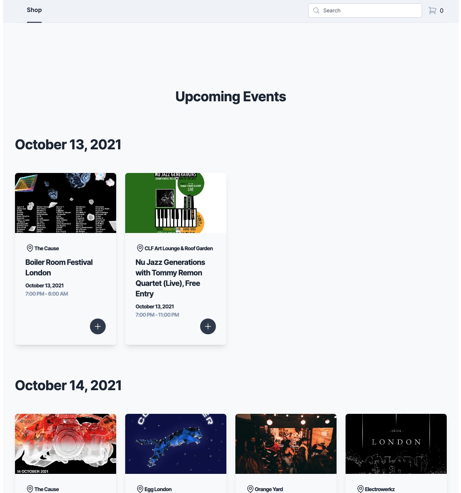

# How to install

```bash
npm i -g pnpm
```

```bash
pnpm build && pnpm preview
```

Deployed at:

https://toolonguuid-davidsanwald.vercel.app/



# Aspects I invested some time, despite having only very limited time available

- low cyclomatic complexity
- respecting Jeff Bay's Object Calisthenics whenever possible
- no duplication of state, that would require to be kept in sync
- using a query string for the search, to enable users to share or bookmark their results
- validation of backend data, to work with end to end type safety despite not being sure about updated responses
- server responses are cached and immediately shown to the user, once loaded but checked in the background to update the displayed data, when something changed
- I didn't have time for appropriate placeholders but I took care for both cases:
  - flyerFront was non existent, in that case I replaced it with an default value as early as possible, so it could be handled like the other event items and didn't require additional checks
  - urls that didn't resolve as image src were replaced by an eventhandler on the onerror event emitted on img elements in that case
- I tried to use deep modules and barrels to only export/expose what's necessary
- functions avoid returning null or undefined as much as possible, therefore it's also mostly unnecessary to check for argument
- the search is fuzzy because I realized just matching strings in javascript didn't provide any real value for users

## Where I lost time

- I wanted to try vite and vitest for the first time and absolutely underestimated how much extra setup und reading through issues this meant, when trying to integrate it with react-testing-library and jest-dom
- valtio was a new state management library I wanted to try, unfortunately I used snapshot(state) in on place instead of useSnapshot(state), which took way more time to realize than I'd be willing to admit

## Where there's work missing for a production grade app

- Since I struggled with vite and vitest I only had time for one small example test
- I should have used react routers new nested routes to exclude the search bar on the /cart route
- a11y and html structure are very rudimentary
- if deemed necessary there could be many performance optimizations
- the animations are very rough
- at least a small github actions pipeline would have been nice
- loading cards in a grid would have a much shorter perceived loading time, if I used actual skeletons
- some of the data transformations could have been done within the custom query hooks using the select option, I only did this for the generation of the Fuse.JS index, doing it there also allows for sometimes easier memoization
